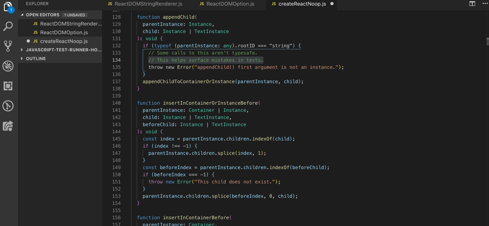

> GifLens **supercharges** the GIF capabilities built into Visual Studio Code. It helps you to **visualize GIFs** at a glance using `GIFLENS` tags and code lens, **seamlessly navigate and explore** Gif repositories, **gain valuable insights** via powerful GIFs, and so much more.

# Code it, GIF it

## Thank you

- The [VS Code](https://code.visualstudio.com/) team for building an awesome open source IDE 🙏
- The [Gitlens](https://github.com/eamodio/vscode-gitlens) team who helped us finding a name for this extension. Love your product too ❤️
- The [Giphy](https://giphy.com/) team for their great api and endless database of amazing GIFs 😎

**Enjoy!**

